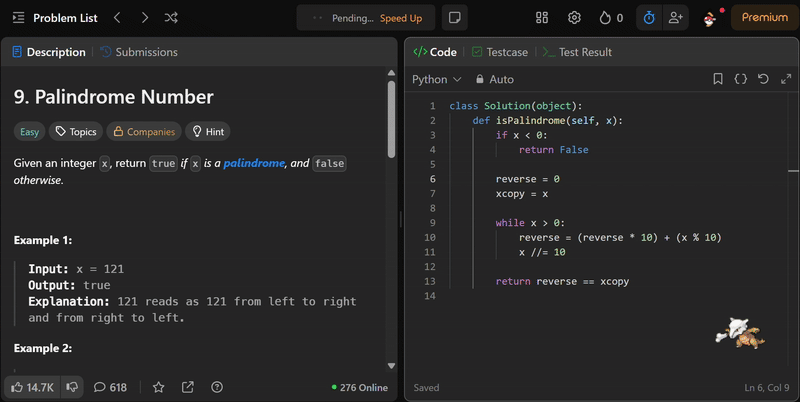

<p align="center"></p>
<h1 align="center">LeetMon</h1>
<h4 align="center">Do Leetcode, catch Pokemon!</h4>

---

<br>

## Table of Contents
- [Introduction](#introduction)
- [Features](#features)
- [Quick Setup for Users](#quick-setup-for-users)
- [Setup and Build for Developers](#setup-and-build-for-developers)
- [Tools](#tools)
- [Browser Support](#browser-support)

<br>

## Introduction

LeetMon is a browser extension made by the WXT framework, and animated using the GSAP library. Users can catch pokemon when they solve Leetcode problems.

<br>

## Features

 *When you open a Leetcode problem, a random Pokemon from gen 1-5 will appear*


---
<br>

 *When you submit a correct solution, you catch the Pokemon*

---

<br>


*View your caught Pokemon by clicking the extension widget*

<br>

## Quick Setup for Users

LeetMon is not currently published on any web stores. Instead, to set up the LeetMon extension in your browser quickly:
1. Go to Releases, and download the zip file for your browser
2. Unzip the folder
3. Go to <a href="chrome://extensions">chrome://extensions</a> and enable Developer mode
4. Click **Load unpacked** and select the unzipped folder
5. Start Leetcoding!

<br>

## Setup and Build for Developers

### Setup
To clone and run this application, you'll need Git and Node.js (which comes with npm) installed on your computer. From your command line:

1. Clone this repository
  ```sh
  git clone https://github.com/emilyclam/leetmon
  ```
2. Go into the repository
  ```sh
  cd leetmon
  ```
3. Install dependencies
  ```sh
  npm install
  ```
4. Run the app
  ```sh
  npm run dev
  ```
<br>

>A new window will open with your extension automatically loaded. Or, follow steps 3-5 of the Quick Setup for Users guide to get your development code running in your regular browser, selecting the appropriate folder from `.output/` to unpack.

<br>

### Build

To build and zip for...

#### Chrome (Default):
```sh
wxt zip
```

#### Firefox:
```sh
wxt zip -b firefox
```

#### Edge:
```sh
wxt zip -b edge
```

<br>

## Tools
LeetMon was built with:
- [WXT](https://wxt.dev/) - web extension framework for bundling and fast development
- [GSAP](http://gsap.com) - JS library for animations
- [PokeApi](https://pokeapi.co/) - RESTful Pokemon API for pokemon sprites and data

<br>

##  Browser Support

| Chrome   | IE  | Edge | Safari  | Firefox   |
| :---------: | :---------: | :---------: | :---------: | :---------: |
| Yes | No | Yes | Yes | Yes |
